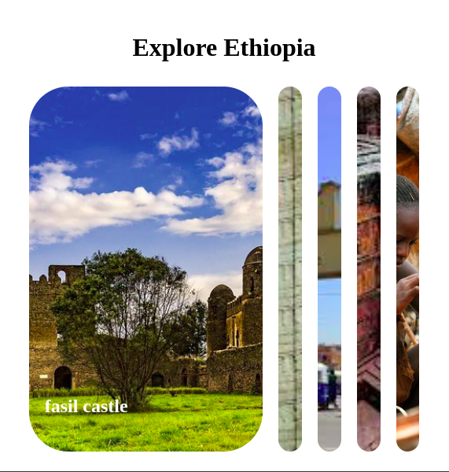

# 📸 Expanding Image Gallery - Explore Ethiopia

This is a simple, responsive "Expanding Cards" image gallery featuring beautiful landmarks from Ethiopia. Clicking on a panel expands it to show the full image and its title, while the other panels shrink.

This project is built purely with HTML, CSS (using Flexbox), and vanilla JavaScript.



## 📜 Description

The main goal of this project is to demonstrate a common UI pattern using CSS Flexbox for layout and transitions, and JavaScript to handle the click events and toggle active classes. The gallery is themed around Ethiopian tourist destinations.

## ✨ Features

* **Click-to-expand**: Click any panel to expand it.
* **Smooth Transitions**: Uses CSS `transition` for a fluid expanding and contracting animation.
* **Dynamic Titles**: Titles (`<h3>`) are hidden by default and fade in only on the active, expanded panel.
* **Responsive Design**: On smaller screens (max-width: 420px), the gallery adjusts to show fewer panels for a better mobile viewing experience.

## 🛠️ Technologies Used

* **HTML5**
* **CSS3** (Flexbox, Transitions, Media Queries)
* **Vanilla JavaScript** (ES6+ `forEach`, Event Listeners, `classList`)

## 🚀 How to Use

Simply clone or download this repository and open the `index.html` file in any modern web browser to see it in action.

```bash
# If you have git installed
git clone [https://github.com/issac-D/HTML-CSS-and-JavaScript-Projects-Package-One.git]
#on the terminal(after clonning)
cd HTML-CSS-and-JavaScript-Projects-Package-One 
# or you can search the following link on your browser
(https://github.com/issac-D/HTML-CSS-and-JavaScript-Projects-Package-One.git)

# Then, open index.html in your browser
```