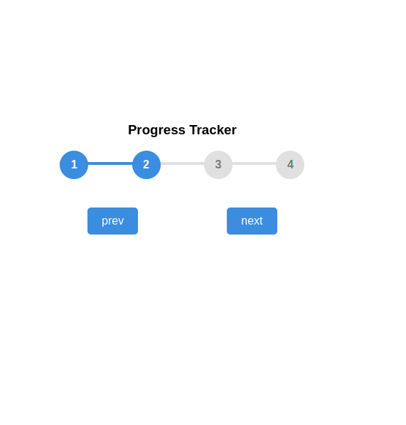

# 📈 Progress Tracker Steps

This is a simple, interactive progress tracker component that visually guides a user through a sequence of steps. It's an excellent demonstration of updating a UI's state using vanilla JavaScript and dynamic CSS manipulation.



## 🎯 Project Goal

The primary goal was to create a functional and visually appealing step-by-step indicator where the user can move forward or backward through the process, with the visual progress bar dynamically updating to reflect the current step.

## ✨ Features

* **Interactive Buttons**: `NEXT` and `PREV` buttons to navigate between steps.
* **Dynamic Highlighting**: Circles become highlighted (`active` class) as the user progresses.
* **Visual Progress Bar**: The blue line between the circles (`.progress` element) dynamically expands and contracts using JavaScript to match the current step.
* **Button State Management**: The `PREV` button is disabled on the first step, and the `NEXT` button is disabled on the last step.

## 💻 Technologies Used

* **HTML5**: Structure of the progress tracker, circles, and buttons.
* **CSS3**: Styling the components, using **Flexbox** for layout, and applying transitions for a smooth visual effect.
* **Vanilla JavaScript**:
    * Listening for button clicks (`addEventListener`).
    * Managing the `currentActive` state variable.
    * Toggling the `active` class on circles.
    * Calculating and setting the `.progress` bar width dynamically.
    * Enabling/disabling the navigation buttons.

## 🚀 How to Run

1.  **Clone the repository:**
    ```bash
    git clone [https://github.com/your-username/your-repo-name.git](https://github.com/your-username/your-repo-name.git)
    ```
2.  **Navigate to the project directory:**
    ```bash
    cd your-repo-name
    ```
3.  **Open `index.html`** in your web browser.

## 📝 Code Overview

The core logic resides in the `update()` function in `script.js`:

1.  It iterates over all circles to add or remove the `.active` class based on `currentActive`.
2.  It calculates the percentage width for the progress bar:
    $$\text{Width} = \frac{\text{Number of Active Steps} - 1}{\text{Total Steps} - 1} \times 100\%$$
3.  It sets the `disabled` property for the `prev` and `next` buttons based on whether the first or last step is reached.